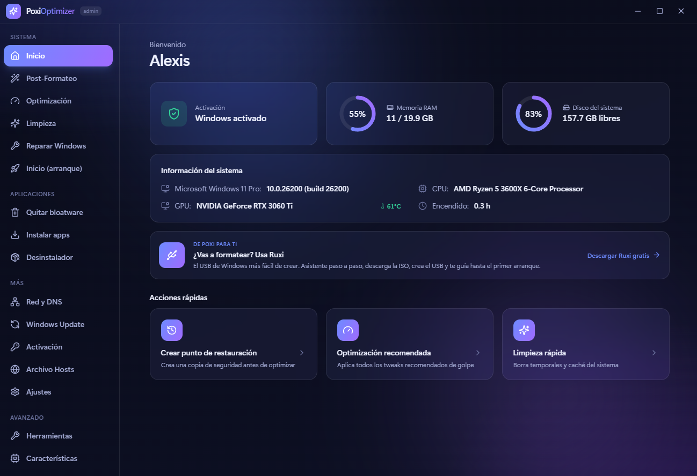

<div align="center">

# ⚡ PoxiOptimizer

**La herramienta definitiva para optimizar, limpiar y activar Windows.**
**The ultimate tool to optimize, clean and activate Windows.**

[](https://tauri.app)
[](https://react.dev)
[](https://www.rust-lang.org)
[](#)
[](LICENSE)

*Interfaz glassmorphism · ejecutable ligero · 100 % seguro y reversible*



</div>

---

## 🇪🇸 Español

**PoxiOptimizer** es un optimizador todo-en-uno para Windows 10 y 11 con una interfaz moderna y cuidada. Reúne en un solo lugar lo mejor de herramientas como *winutil* (Chris Titus) y *Optimizer* (hellzerg), añade un **multi-desinstalador**, un **instalador de aplicaciones** y un **activador de Windows/Office** basado en *Microsoft Activation Scripts* (massgravel).

### ✨ Características

| Módulo | Qué hace |
|--------|----------|
| 🪄 **Post-Formateo** | **¡Un clic para dejar tu PC perfecto tras formatear!** Punto de restauración → quita bloatware → perfil Gaming → instala tus apps → Chrome predeterminado → DNS de Google → activa Windows → Update solo seguridad → desactiva el inicio. Con progreso animado paso a paso. |
| 🏠 **Inicio** | Panel con info del sistema (CPU, GPU, RAM, disco), estado de activación y acciones rápidas. |
| ⚙️ **Optimización** | +30 *tweaks* **seguros y reversibles** + **perfiles 1 clic** (Recomendado, Gaming, Privacidad) + sección **Avanzado (bajo tu riesgo)**. |
| ✨ **Limpieza** | Temporales, caché de Update y navegadores, miniaturas, logs, cola de impresión, papelera, DNS y **WinSxS** (DISM). |
| 🔧 **Reparar Windows** | **SFC**, **DISM** (RestoreHealth) y **restablecer Windows Update**. |
| 🚀 **Inicio (arranque)** | Activa/desactiva los programas que arrancan con Windows. |
| 🌐 **Red y DNS** | Cambia a **Google DNS** o Cloudflare con un clic. |
| 🔄 **Windows Update** | Por defecto · Solo seguridad · Deshabilitado. |
| 🗑️ **Quitar bloatware** | Desinstala apps de la Store. Componentes críticos **protegidos**. |
| ⬇️ **Instalar apps** | Catálogo de +50 programas + **buscador winget en vivo**. |
| 📦 **Desinstalador** | Lista **todos** los programas y los desinstala en lote. |
| 🔑 **Activación** | Activa Windows (HWID) y Office (Ohook) vía **MAS**, con resultado en español. |
| 🌐 **Hosts** | Gestor del archivo hosts del sistema. Bloquea rastreadores, telemetría de Microsoft y más con un clic. |
| 🔧 **Herramientas del sistema** | Acceso rápido con un clic a 18 herramientas de administración de Windows (Administrador de tareas, Registro, Firewall, Gestión de discos…). |
| ⚙️ **Características de Windows** | Activa/desactiva características opcionales: .NET 2/3, Hyper-V, WSL, Windows Sandbox, OpenSSH y más. |
| 💾 **Configuración** | **Exportar/importar** ajustes, **historial de acciones** con deshacer, **backup del registro** y comprobar actualizaciones. |

### 🛡️ Seguridad ante todo

- ✅ **Todos los tweaks son reversibles**: lo que activas, lo puedes desactivar.
- ✅ **Punto de restauración** con un clic antes de optimizar.
- ✅ **Componentes críticos protegidos**: no se puede romper el menú Inicio, la tienda ni la seguridad.
- ✅ **Nada experimental**: solo ajustes conocidos y probados.
- ✅ Se ejecuta como **administrador** (UAC) para aplicar los cambios correctamente.

### 🚀 Instalación

1. Descarga el instalador `PoxiOptimizer_3.5.2_x64-setup.exe` desde la pestaña [Releases](https://github.com/PoxiiTV/PoxiOptimizer/releases).
2. Ejecútalo y sigue el asistente.
3. Abre **PoxiOptimizer** y acepta el aviso de administrador.

> El ejecutable es **muy ligero** (~5–10 MB) porque reutiliza el motor WebView2 ya incluido en Windows 11.

### 🧑‍💻 Compilar desde el código

Requisitos: [Node.js](https://nodejs.org), [Rust](https://rustup.rs) y las *Build Tools* de Visual Studio (C++).

```bash
npm install            # instala dependencias
npm run tauri dev      # desarrollo (o ejecuta start.bat)
npm run tauri build    # genera el instalador en src-tauri/target/release/bundle
```

---

## 🇬🇧 English

**PoxiOptimizer** is an all-in-one optimizer for Windows 10 and 11 with a modern, polished interface. It brings together the best of tools like *winutil* (Chris Titus) and *Optimizer* (hellzerg), adding a **multi-uninstaller**, an **app installer** and a **Windows/Office activator** based on *Microsoft Activation Scripts* (massgravel).

### ✨ Features

| Module | What it does |
|--------|--------------|
| 🪄 **Post-Format** | **One click to get your PC perfect after a fresh install!** Restore point → remove bloatware → Gaming profile → install your apps → Chrome default → Google DNS → activate Windows → security-only Update → disable startup. With animated step-by-step progress. |
| 🏠 **Home** | Dashboard with system info (CPU, GPU, RAM, disk), activation status and quick actions. |
| ⚙️ **Optimization** | 30+ **safe, reversible tweaks** + **1-click profiles** (Recommended, Gaming, Privacy) + **Advanced (at your own risk)** section. |
| ✨ **Cleanup** | Temp files, Update & browser cache, thumbnails, logs, print queue, recycle bin, DNS and **WinSxS** (DISM). |
| 🔧 **Repair Windows** | **SFC**, **DISM** (RestoreHealth) and **reset Windows Update**. |
| 🚀 **Startup** | Enable/disable programs that launch with Windows. |
| 🌐 **Network & DNS** | Switch to **Google DNS** or Cloudflare in one click. |
| 🔄 **Windows Update** | Default · Security only · Disabled. |
| 🗑️ **Remove bloatware** | Uninstalls Store apps. Critical components **protected**. |
| ⬇️ **Install apps** | Catalog of 50+ programs + **live winget search**. |
| 📦 **Uninstaller** | Lists **every** program and removes them in batch. |
| 🔑 **Activation** | Activates Windows (HWID) and Office (Ohook) via **MAS**, with result in Spanish. |
| 🌐 **Hosts** | System hosts file manager. Block trackers, Microsoft telemetry and more in one click. |
| 🔧 **System tools** | One-click access to 18 Windows admin tools (Task Manager, Registry Editor, Firewall, Disk Management…). |
| ⚙️ **Windows features** | Enable/disable optional features: .NET 2/3, Hyper-V, WSL, Windows Sandbox, OpenSSH and more. |
| 💾 **Configuration** | **Export/import** tweaks, **action history** with undo, **registry backup** and update check. |

### 🛡️ Safety first

- ✅ **Every tweak is reversible** — what you enable, you can disable.
- ✅ **One-click restore point** before optimizing.
- ✅ **Critical components protected** — the Start menu, Store and security can't be broken.
- ✅ **Nothing experimental** — only well-known, tested settings.
- ✅ Runs as **administrator** (UAC) to apply changes correctly.

### 🚀 Installation

1. Download `PoxiOptimizer_3.5.2_x64-setup.exe` from the [Releases](https://github.com/PoxiiTV/PoxiOptimizer/releases) tab.
2. Run it and follow the wizard.
3. Open **PoxiOptimizer** and accept the administrator prompt.

> The executable is **very lightweight** (~5–10 MB) because it reuses the WebView2 engine already bundled in Windows 11.

### 🧑‍💻 Build from source

Requirements: [Node.js](https://nodejs.org), [Rust](https://rustup.rs) and Visual Studio C++ Build Tools.

```bash
npm install            # install dependencies
npm run tauri dev      # development
npm run tauri build    # build the installer
```

---

## 🧩 Stack

- **Tauri 2** (Rust) — ejecutable nativo y ligero / lightweight native binary
- **React 19 + TypeScript + Vite** — interfaz / UI
- **Tailwind CSS 4 + Framer Motion** — diseño y animaciones / design & motion
- **PowerShell** — operaciones del sistema / system operations

## 🙏 Créditos / Credits

Inspirado en / Inspired by:
[winutil](https://github.com/christitustech/winutil) · [Optimizer](https://github.com/hellzerg/optimizer) · [Microsoft Activation Scripts](https://github.com/massgravel/Microsoft-Activation-Scripts)

## ⚠️ Aviso / Disclaimer

La función de activación descarga y ejecuta el script oficial de **MAS** (proyecto de terceros, open-source). Úsala bajo tu responsabilidad. PoxiOptimizer no aloja ni modifica dicho script.

The activation feature downloads and runs the official **MAS** script (third-party, open-source project). Use at your own risk. PoxiOptimizer does not host or modify that script.

## 📜 Licencia / License

**PoxiOptimizer** se distribuye bajo la **PolyForm Noncommercial License 1.0.0** 🔒.

Libre para **uso personal** — optimizar y mantener tu Windows, aprender y experimentar. Prohibido el **uso comercial**: no se puede vender ni obtener beneficio económico con este proyecto.

📄 Texto completo en [`LICENSE`](LICENSE).

<div align="center">

Hecho con 💜 por **Poxi**

</div>
